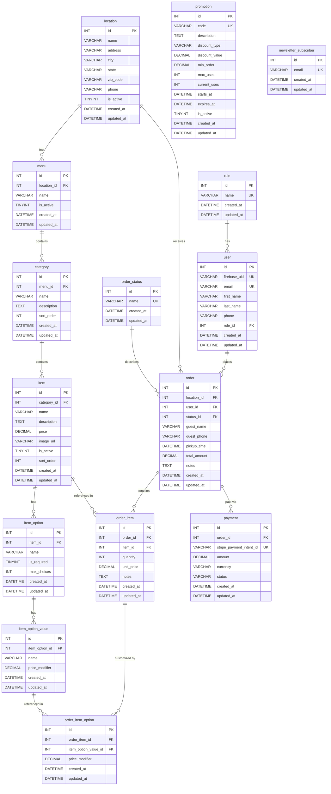

# ER Diagram - Restaurant Ordering Platform

```mermaid
erDiagram

    role {
        INT id PK
        VARCHAR name UK
        DATETIME created_at
        DATETIME updated_at
    }

    user {
        INT id PK
        VARCHAR firebase_uid UK
        VARCHAR email UK
        VARCHAR first_name
        VARCHAR last_name
        VARCHAR phone
        INT role_id FK
        DATETIME created_at
        DATETIME updated_at
    }

    location {
        INT id PK
        VARCHAR name
        VARCHAR address
        VARCHAR city
        VARCHAR state
        VARCHAR zip_code
        VARCHAR phone
        TINYINT is_active
        DATETIME created_at
        DATETIME updated_at
    }

    menu {
        INT id PK
        INT location_id FK
        VARCHAR name
        TINYINT is_active
        DATETIME created_at
        DATETIME updated_at
    }

    category {
        INT id PK
        INT menu_id FK
        VARCHAR name
        TEXT description
        INT sort_order
        DATETIME created_at
        DATETIME updated_at
    }

    item {
        INT id PK
        INT category_id FK
        VARCHAR name
        TEXT description
        DECIMAL price
        VARCHAR image_url
        TINYINT is_active
        INT sort_order
        DATETIME created_at
        DATETIME updated_at
    }

    item_option {
        INT id PK
        INT item_id FK
        VARCHAR name
        TINYINT is_required
        INT max_choices
        DATETIME created_at
        DATETIME updated_at
    }

    item_option_value {
        INT id PK
        INT item_option_id FK
        VARCHAR name
        DECIMAL price_modifier
        DATETIME created_at
        DATETIME updated_at
    }

    order_status {
        INT id PK
        VARCHAR name UK
        DATETIME created_at
        DATETIME updated_at
    }

    order {
        INT id PK
        INT location_id FK
        INT user_id FK
        INT status_id FK
        VARCHAR guest_name
        VARCHAR guest_phone
        DATETIME pickup_time
        DECIMAL total_amount
        TEXT notes
        DATETIME created_at
        DATETIME updated_at
    }

    order_item {
        INT id PK
        INT order_id FK
        INT item_id FK
        INT quantity
        DECIMAL unit_price
        TEXT notes
        DATETIME created_at
        DATETIME updated_at
    }

    order_item_option {
        INT id PK
        INT order_item_id FK
        INT item_option_value_id FK
        DECIMAL price_modifier
        DATETIME created_at
        DATETIME updated_at
    }

    payment {
        INT id PK
        INT order_id FK
        VARCHAR stripe_payment_intent_id UK
        DECIMAL amount
        VARCHAR currency
        VARCHAR status
        DATETIME created_at
        DATETIME updated_at
    }

    promotion {
        INT id PK
        VARCHAR code UK
        TEXT description
        VARCHAR discount_type
        DECIMAL discount_value
        DECIMAL min_order
        INT max_uses
        INT current_uses
        DATETIME starts_at
        DATETIME expires_at
        TINYINT is_active
        DATETIME created_at
        DATETIME updated_at
    }

    newsletter_subscriber {
        INT id PK
        VARCHAR email UK
        DATETIME created_at
        DATETIME updated_at
    }

    %% Relationships
    role          ||--o{ user               : "has"
    user          ||--o{ order              : "places"
    location      ||--o{ menu               : "has"
    location      ||--o{ order              : "receives"
    menu          ||--o{ category            : "contains"
    category      ||--o{ item               : "contains"
    item          ||--o{ item_option         : "has"
    item_option   ||--o{ item_option_value   : "has"
    order_status  ||--o{ order              : "describes"
    order         ||--o{ order_item          : "contains"
    order         ||--o{ payment             : "paid via"
    order_item    ||--o{ order_item_option   : "customized by"
    item          ||--o{ order_item          : "referenced in"
    item_option_value ||--o{ order_item_option : "referenced in"
```
